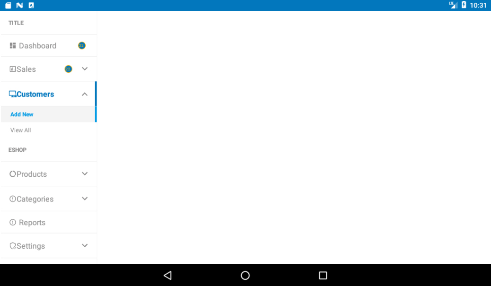

# Android BH Apps Menus

Android BH Apps Menus has functions for fast prototyping and development of Android Applications that require features and functionality to build upon.

* Still Under Development, docs, updates to be on going

# To be Done

* ~~Add responsive methods & functions~~
* ~~Add method/functions for child menu item to modify parent menu item~~
* Add menu item animations
* Add fixes to layouts/positions/etc for icon/title/badge views
* ~~Add fixes to badge layout~~
* Add settings for menu items title text view (paddings, margins)
* Add menu build function to process HashMap<ParentMenuItem, List<ChildMenuItem>>, ~~List/ArrayList~~, ~~JSON (String)~~, XML etc
* Add option to pass shimmer animation layout to menu
* Add Horizontal Menu
* Add doc links to methods etc

# Built Using

* Java
* Kotlin
* Xml
* Json

# Screenshots

| Vertical Menu - Left Sided - Icons Only           | 
:---------------------------------------------------:

| Vertical Menu - Right Sided - Icons Only           | 
:---------------------------------------------------:

| Vertical Menu - Left Sided - Parent with Children Menus         | 
:---------------------------------------------------:

| Vertical Menu - Left Sided - Parent Only with Chip Active State | 
:---------------------------------------------------:

| Vertical Menu - Left Sided - Parent Only with Gradient Active State | 
:---------------------------------------------------:

# How to Use

* Add the JitPack repository to your build file 

<pre>
allprojects {
  repositories {
    maven { url 'https://jitpack.io' }
  }
}
</pre>

* Add the dependency

<pre>
dependencies {
   implementation 'com.github.bhapps:BHAppsMenus:0.0.1-alpha'
}
</pre>

<pre>

  * see demo app for examples

</pre>

<pre>

  * xml Layout

</pre>

<pre>

  * Activity (Kotlin)
   
</pre>

# Functions

# Libraries

* AndroidX
* Kotlin

# Licences

* The Unlicense

<pre>

This is free and unencumbered software released into the public domain.

Anyone is free to copy, modify, publish, use, compile, sell, or
distribute this software, either in source code form or as a compiled
binary, for any purpose, commercial or non-commercial, and by any
means.

In jurisdictions that recognize copyright laws, the author or authors
of this software dedicate any and all copyright interest in the
software to the public domain. We make this dedication for the benefit
of the public at large and to the detriment of our heirs and
successors. We intend this dedication to be an overt act of
relinquishment in perpetuity of all present and future rights to this
software under copyright law.

THE SOFTWARE IS PROVIDED "AS IS", WITHOUT WARRANTY OF ANY KIND,
EXPRESS OR IMPLIED, INCLUDING BUT NOT LIMITED TO THE WARRANTIES OF
MERCHANTABILITY, FITNESS FOR A PARTICULAR PURPOSE AND NONINFRINGEMENT.
IN NO EVENT SHALL THE AUTHORS BE LIABLE FOR ANY CLAIM, DAMAGES OR
OTHER LIABILITY, WHETHER IN AN ACTION OF CONTRACT, TORT OR OTHERWISE,
ARISING FROM, OUT OF OR IN CONNECTION WITH THE SOFTWARE OR THE USE OR
OTHER DEALINGS IN THE SOFTWARE.

For more information, please refer to <http://unlicense.org>

</pre>

